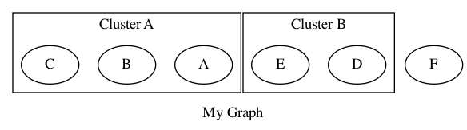
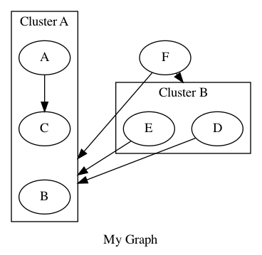
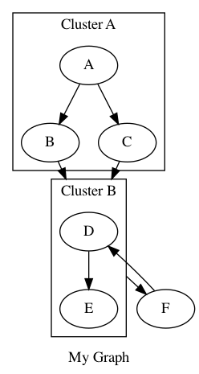
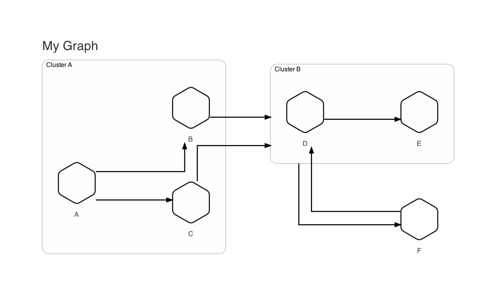
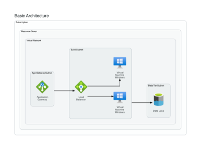
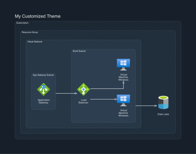

  - [Introduction](#introduction)
  - [Installation](#installation)
  - [Core Components](#core-components)
    - [Containers](#containers)
    - [Components](#components)
    - [Connections](#connections)
  - [Example Architecture](#example-architecture)
    - [Code](#code)
    - [Output](#output)
  - [How To](#how-to)
    - [Part 1 - Importing the Core Module](#part-1---importing-the-core-module)
    - [Part 2 - Creating a Graph](#part-2---creating-a-graph)
    - [Part 3 - Adding Nodes to a Graph](#part-3---adding-nodes-to-a-graph)
    - [Part 4 - Grouping Nodes on a Graph](#part-4---grouping-nodes-on-a-graph)
    - [Part 5 - Connecting Nodes and Clusters](#part-5---connecting-nodes-and-clusters)
    - [Part 6 - Using Themes](#part-6---using-themes)
    - [Part 7 - Using Providers](#part-7---using-providers)
  - [Tips and Tricks](#-tips-and-tricks)
    - [Using Colors](#-using-colors)
    - [Modifying Layout](#-modifying-layout)

## Introduction
[](/LICENSE)


[](https://codecov.io/gh/Jsoconno/architectures)
[](https://www.codefactor.io/repository/github/jsoconno/architectures)


Today, almost everything is managed as code including applications, infrastructure, configurations, processes, and more.  Architectures was created to allow teams to manage architecture as code using Python.

The goal for this project is to make drawing architecture diagrams with code simple and to enable the use of version control systems and standard coding practices such as pull requests, code reviews, and approvals to eliminate the toil associated with diagram creation and maintenance.

Architectures comes with support for several providers out-of-the-box.


## Installation
Architectures works for all version of python greater than version `3.7.x`.

It is recommended to use Graphviz version `2.41.x` or later.
### Install Mac OS Dependencies
1) Install Python:
```
brew install python
```
2) Install Graphviz:
```
brew install graphviz
```
### Install Windows Dependencies
1) Install Python:

[Manual Install](https://www.python.org/downloads/) or...
```
choco install python
```
2) Install Graphviz

[Manual Install](https://forum.graphviz.org/t/new-simplified-installation-procedure-on-windows/224) or...
```
choco install graphviz
```
### Download Architectures from PyPi
Architectures can be installed using the following command once all dependencies for your operating system are in place:
```
pip install architectures
```

## Core Components
There are several supported objects in the architectures library.  These objects primarily fall into three categories:
### Containers
- **Graphs** allow users to create a base canvas to create their diagram on
- **Clusters** allow users to group **Nodes** into bounded container
- **Groups** allow users to logically group **Nodes** with no bounding container
### Components
- **Nodes** allow users to create an object that represents a service
- **Anchors** _[coming soon]_ will allow users to better control direction and connection points of Edges.
### Connections
- **Edges** allow users to draw a line between a pair or list of **Nodes**, **Clusters**, or **Groups**
- **Flows** allow users to create a linear flow through a list of **Nodes**, **Clusters**, or **Groups**

The Node object is extended with subclasses that allow for the creation of standard service components from various providers such as Azure, GCP, and AWS.  Read on for some examples.
## Example Architecture
Here is an example that shows how you can create a beautiful diagram using architectures.  This example is an Azure Event Driven Serverless Architecture in dark mode.

### Code
```
from architectures.core import *
from architectures.themes import LightMode, DarkMode

from architectures.providers.azure.ai import CognitiveServices
from architectures.providers.azure.application import FunctionApp, EventGridDomain
from architectures.providers.azure.data import AzureCosmosDb
from architectures.providers.azure.general import Computer
from architectures.providers.azure.storage import StorageAccountBlob

theme = DarkMode()

with Graph("Event Driven Serverless Architecture", theme=theme):
    computer = Computer("Single Page Web App")
    with Cluster():
        function_get_upload_url = FunctionApp("Function (get upload url)")
        function_list_images = FunctionApp("Function (list images)")
        function_resize = FunctionApp("Function (resize & recognize image)")
        function_write_metadata = FunctionApp("Function (write metadata)")
    blob_storage = StorageAccountBlob("Blob Storage (images, thumbnails)")
    event_grid = EventGridDomain("Event Grid (async events)")
    cosmos_db = AzureCosmosDb("Cosmos DB (image metadata)")
    cognitive_services = CognitiveServices("Cognitive Services (computer vision)")

    # Flow([function_get_upload_url, function_list_images, function_resize], color="green")
    Flow([computer, [function_get_upload_url, blob_storage, function_list_images]])
    Edge([function_get_upload_url, function_resize], blob_storage)
    Edge(blob_storage, function_resize, style="dashed")
    Edge(function_resize, [cognitive_services, event_grid])
    Edge(event_grid, function_write_metadata, style="dashed")
    Edge(function_write_metadata, cosmos_db)
    Edge(function_list_images, cosmos_db, constraint="false") # This constraint setting ensures the edge does not force ranking
    Edge(function_resize, function_write_metadata, color="invis") # This ensures alignment between these two function apps
```
### Output


## How To
This step-by-step guide will walk you through the features and functionalities of architectures so you can start writing your own architecture as code.

It will first cover the basics, creating diagrams that are not so pretty, but demonstrate the functionality.  Additional imports will be layered on and introduced into the code to show how to achieve the desired end goal of simple and beautiful architecture diagrams.
### Part 1 - Importing the Core Module
The first thing you will need to do is to import the `core` module.  This module contains all of the core functionality required for creating architectures.

You can explicitly import only the objects that you need...
```
from architectures.core import Graph, Cluster, Group, Node, Edge, Flow
```
... or import everything using `*`.
```
from architectures.core import *
```
For more information on these objects, see the [Core Components](##core-components) section above.
### Part 2 - Creating a Graph
Once you have imported the core module, you will need to use the `Graph` object to create the canvas that will be used for creating your architecture diagram.

This is the simplest graph you can make:
```
from architectures.core import Graph

with Graph():
    pass
```
Graph accepts the following optional arguments:
* `name (str)` - the title to give your diagram
* `output_file_name (str)` - the name of the output file
* `output_file_format (str)` - the type of file to output
* `theme (Theme object)` - the theme to apply
* `show (bool)` - whether or not to show the diagram when code is run

If no name is given, the diagram title and output file name will be set to a default value.  The default theme is the Graphviz default.  The default output file format is PNG.

### Part 3 - Adding Nodes to a Graph
Once a Graph is created, you will want to start adding objects to it.  One of the most basic objects you can create is a `Node`.
```
from architectures.core import Graph, Node

with Graph("My Graph"):
    Node()
```
You can give a Node a name.
```
    Node("My Node")
```
And pass attributes as keyword arguments to change the way things look.
```
    Node("My Node", style="dotted", color="grey")
```
You can add multiple Nodes to a Graph.
```
from architectures.core import Graph, Node

with Graph("My Graph"):
    Node("A")
    Node("B")
    Node("C")
    Node("D")
    Node("E")
```
Node objects accept the following optional arguments:
* `label (str)` - the label given to the Node
* `wrap_label_text (bool)` - a flag to determine if label text should be automatically wrapped
* `**attrs` - keyword arguments that are used to pass attributes to the Node to override defaults

If no label is given, the Node will appear without a label.  For provider classes (to be seen later), a default label is set based on the service being added to the canvas.  The default for word wrap is true.

For more information on available Node attributes, check out the [Graphviz Attributes Documentation](https://graphviz.org/doc/info/attrs.html).
### Part 4 - Grouping Nodes on a Graph
No doubt you will want to be able to logically group Nodes on your architecture diagram.  You can do this with the `Cluster` and `Group` objects.

The primary difference between a Cluster and a Group is that a Cluster will draw a border around a collection of Nodes while a Group will not.  Clusters and Groups must both be contained by a Graph.

For more information on these objects, see the [Core Components](##core-components) section above.

Below is a code example of Nodes contained by Clusters on the Graph.

```
from architectures.core import Graph, Cluster, Node

with Graph("My Graph"):
    with Cluster("Cluster A"):
        Node("A")
        Node("B")
        Node("C")

    with Cluster("Cluster B"):
        Node("D")
        Node("E")

    Node("F")
```
The code above will generate a diagram that looks like this:



Note that objects on the Graph are created in the reverse order that they are found in the code.  This is not always something you have to consider, but keep in mind it can have an impact on the final layout.  In particular for larger, more complex diagrams.

Cluster and Group objects accept the following optional arguments:
* `label (str)` - the label given to the Cluster or Group
* `**attrs` - keyword arguments that are used to pass attributes to the Cluster or Group to override defaults

If no label is given, Clusters and Groups will appear without a label.

For more information on available Node attributes, check out the [Graphviz Attributes Documentation](https://graphviz.org/doc/info/attrs.html).

### Part 5 - Connecting Nodes and Clusters
A collection of Nodes, Clusters, and Groups might not be all that useful by themselves.  To start defining relationships, you will want to draw lines between them.  This can be done using the `Edge` and `Flow` objects.

It is important to assign Nodes, Clusters, and Groups to a variable so they can be referenced when drawing Edges or Flows.

The example below shows several different scenarios and builds on the previous example in Part 4.

```
with Graph("My Graph"):
    with Cluster("Cluster A") as cluster_a:
        a = Node("A")
        b = Node("B")
        c = Node("C")

    with Cluster("Cluster B") as cluster_b:
        d = Node("D")
        e = Node("E")

    f = Node("F")

    # This will connect nodes a and c
    Edge(a, c)

    # This will connect nodes d and e to cluster a
    Edge([d, e], cluster_a)

    # This will connect node f to cluster a and b
    Edge(f, [cluster_a, cluster_b])
```


You can also pass keyword arguments to modify attributes on an Edge.  For example:
```
...
Edge(a, c, dir="both", color="blue")
...
```

The Flow object is similar to the Edge object in that it can connect Nodes.  However, it allows for a list of objects so you can create an end-to-end flow on a diagram.
```
from architectures.core import Graph, Cluster, Group, Node, Edge, Flow

with Graph("My Graph"):
    with Cluster("Cluster A") as cluster_a:
        a = Node("A")
        b = Node("B")
        c = Node("C")

    with Cluster("Cluster B") as cluster_b:
        d = Node("D")
        e = Node("E")

    f = Node("F")

    Flow([a, [b, c], cluster_b, f, d, e])
```


As you can see, the Flow object is a powerful way to streamline your code when connecting multiple Node objects together in sequence.

Note that, as with Edges, the Flow object also accepts keyword arguments to set attributes.

Edge objects accept the following required arguments:
* `start_node (Cluster, Group, or Node object(s))` - the the source object(s) from where the Edge will originate
* `end_node (Cluster, Group, or Node object(s))` - the destination object(s) to where th Edge will terminate

Flow objects accept the follow required arguments:
* `nodes (list)` - a list of Cluster, Group, or Node objects to flow through

Both Edge and Flow objects support the following optional arguments:
* `**attrs` - keyword arguments that are used to pass attributes to the Edge to override defaults

For more information on available Edge attributes, check out the [Graphviz Attributes Documentation](https://graphviz.org/doc/info/attrs.html).

### Part 6 - Using Themes
Although you can now draw any combinations of Clusters, Groups, Nodes, Edges, and Flows on your Graph, you are probably not too happy with the overall appearance of your diagram.  The Default theme is great for prototyping, but not what you would want to share with your team.

`Themes` allow you to style your architecture diagram so that it looks professional.  You can import any pre-defined themes from the themes module.  Currently supported Themes include:
* `Default` - the standard Graphviz settings for drawing diagrams
* `LightMode` - a generic light mode theme for architecture design
* `DarkMode` - like LightMode, but cooler
```
from architectures.themes import Default, LightMode, DarkMode
```
Here is our previous code example using the LightMode theme.
```
from architectures.core import Graph, Cluster, Group, Node, Edge, Flow

# Import the LightMode theme
from architectures.themes import LightMode

theme = LightMode()

with Graph("My Graph", theme=theme):
    with Cluster("Cluster A") as cluster_a:
        a = Node("A")
        b = Node("B")
        c = Node("C")

    with Cluster("Cluster B") as cluster_b:
        d = Node("D")
        e = Node("E")

    f = Node("F")

    Flow([a, [b, c], cluster_b, f, d, e])
```


This does not look great right now because themes were meant to be used with provider objects that represent services (e.g. Storage, Firewall, Database, etc.).  We will see how this works in the next section.

Theme objects accept the following optional arguments:
* `graph_attr_overrides (dict)` - overrides to theme defaulted graph attributes
* `cluster_attr_overrides (dict)` - overrides to theme defaulted cluster attributes
* `node_attr_overrides (dict)` - overrides to theme defaulted node attributes
* `edge_attr_overrides (dict)` - overrides to theme defaulted edge attributes
* `color_overrides (list)` - overrides to theme defaulted color attributes that are used to determine what the background color of a Cluster will be

Here is an example:
```
...
# Set the theme and add overrides
theme = LightMode(
    graph_attr_overrides={"labeljust":"c", "nodesep":"0.5"}, 
    cluster_attr_overrides={"style":"dotted"},
    node_attr_overrides={"fontcolor":"dimgrey"}, 
    edge_attr_overrides={"color":"dimgrey"},
    color_overrides=["#EBF4FA" "#D7E9F5", "#C3DEEF", "#AFD3EA"]
)
...
```

For more information on available attributes, check out the [Graphviz Attributes Documentation](https://graphviz.org/doc/info/attrs.html).

### Part 7 - Using Providers
Now that you know how to use the available core objects to draw a diagram, you will want to start using the available providers to create a real architecture diagram.  Providers represent things like Amazon Web Services, Google Cloud Platform, and Azure Cloud.  

Each service from these providers is represented by a class that inherits from the base Node class.  Architectures supports a variety of providers to allow you to create beautiful architecture diagrams across multiple platforms.  Each service object works exactly like the Node in the earlier examples.

Here is an example of how you can import services and themes to create a nice looking diagram.
```
# Import the base objects
from architectures.core import Graph, Cluster, Group, Node, Edge, Flow

# Import the available themes
from architectures.themes import LightMode, DarkMode

# Import provider services
from architectures.providers.azure.networking import ApplicationGateway, LoadBalancer
from architectures.providers.azure.compute import VirtualMachineWindows
from architectures.providers.azure.data import DataLake

# Set the theme
theme = LightMode()

with Graph("Basic Architecture", theme=theme):
    with Cluster("Subscription"):
        with Cluster("Resource Group"):
            with Cluster("Virtual Network"):
                with Cluster("App Gateway Subnet") as app_gateway_subnet:
                    app_gateway = ApplicationGateway()
                with Cluster("Build Subnet") as build_subnet:
                    load_balancer = LoadBalancer()
                    vm_1 = VirtualMachineWindows()
                    vm_2 = VirtualMachineWindows()
                with Cluster("Data Tier Subnet") as data_tier_subnet:
                    data_lake = DataLake()

    Flow([app_gateway_subnet, load_balancer, [vm_1, vm_2]])
    Edge(build_subnet, data_lake)
```


Here is what the same diagram would look like just by switching the theme to `DarkMode`.
```
...
# Set the theme
theme = DarkMode()
...
```


## Tips and Tricks
### Using Colors
Colors can be used to change an objects background, border, fill, font color, and more.  You can use hex colors or the Graphviz default color scheme names.

Some great resources for finding colors to change the style of your theme are:
* [Google's Material Design Color Tool](https://material.io/resources/color/)
* [Color Hunt](https://colorhunt.co/)
* [Colormind](http://colormind.io/)

To see all all of the build-in colors, check out the [Graphviz Color Name Documentation](https://graphviz.org/doc/info/colors.html).

### Modifying Layout
There are several attributes that can have a big impact on the way your diagram looks.  Here are some of the major ones:
* `rankdir` - great for quickly changing the direction of objects layed out on your diagram
* `constraint` - helps to reduce some Edge constraints to get the layout you want
* `style` - allows you to change the way things look by making them dotted, dashed, or invisible
* `nodesep` - change the amount of separation between nodes which can have an impact on linen layout
* `ranksep` - small changes to this can have big effect on the output of your graph

In addition to attributes that you can modify, you can change the order of the objects in your configuration.  The underlying `dot` engine algorithm used for laying things out renders objects in the reverse order that they are found in your Graph.  Sometimes, reordering things can go a long way to cleaning things up.

MORE TO ADD HERE LATER WITH SOME EXAMPLES